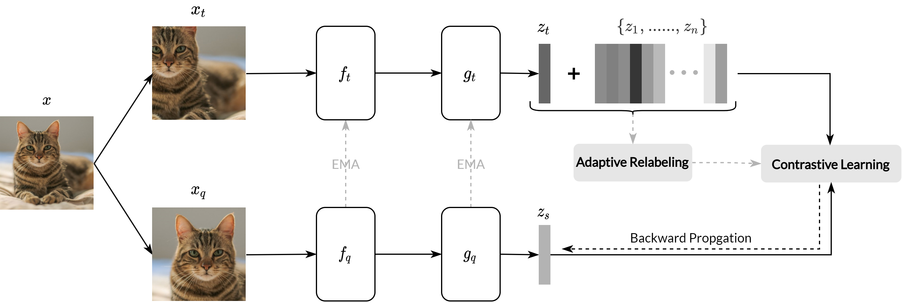
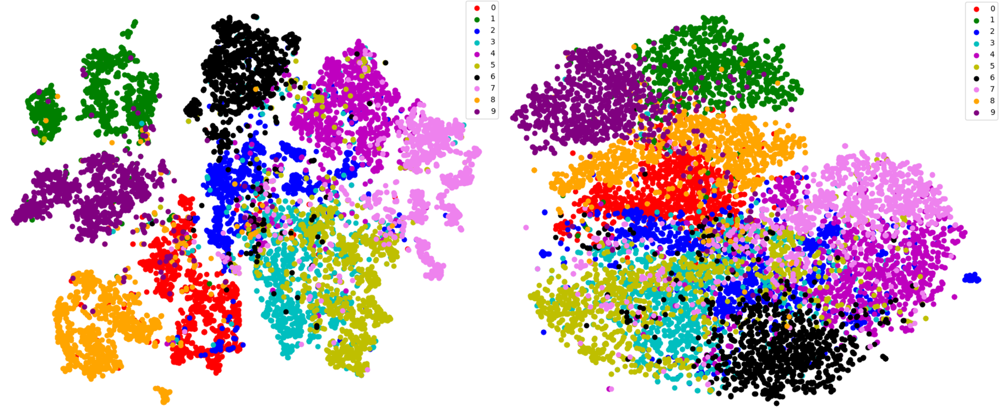

## ASCL: Adaptive Soft Contrastive Learning

<p align="center">
    
</p>

This is the official PyTorch implementation of [ASCL](https://arxiv.org/abs/2207.11163). 

### Abstract
Self-supervised learning has recently achieved great
success in representation learning without human annotations.
The dominant method — that is contrastive learning is generally
based on instance discrimination tasks, i.e., individual samples
are treated as independent categories. However, presuming all
the samples are different contradicts the natural grouping of
similar samples in common visual datasets, e.g., multiple views
of the same dog. To bridge the gap, this paper proposes an adaptive
method that introduces soft inter-sample relations, namely
Adaptive Soft Contrastive Learning (ASCL). More specifically,
ASCL transforms the original instance discrimination task into a
multi-instance soft discrimination task, and adaptively introduces
inter-sample relations. As an effective and concise plug-in module
for existing self-supervised learning frameworks, ASCL achieves
the best performance on several benchmarks in terms of both
performance and efficiency.


```bibtex
@INPROCEEDINGS{ASCL,  
author={Feng, Chen and Patras, Ioannis},  
booktitle={2022 26th International Conference on Pattern Recognition (ICPR)},   
title={Adaptive Soft Contrastive Learning},   
year={2022},  
volume={},  
number={},  
pages={2721-2727},  
doi={10.1109/ICPR56361.2022.9956660}
}
```
Please considering _cite our paper and star this repo_ if you find this repo useful.
### Preparation
- pytorch
- tqdm
- wandb

### Usage
An example run on CIFAR100 dataset with ASCL model:
```
python main.py  --epochs 200 --gpuid 0 --dataset cifar100 --data_path data/CIFAR100 --K 5  --type ascl --t1 0.1 --t2 0.05 --aug weak_augment
```
<p align="center">
    
</p>
<p align="center">
    <em>ASCL VS MoCo</em>
</p>

For users who are not familiar with wandb, please try main_simple.py.
```
python main_simple.py  --epochs 200 --gpuid 0 --dataset cifar100 --data_path data/CIFAR100 --K 5  --type ascl --t1 0.1 --t2 0.05 --aug weak_augment
```


For experiments on ImageNet-1K, we simply modified the official MoCo repo. 
For brevity of this repo, we provide a modified `builder.py` which can be utilized with the original [MoCo](https://github.com/facebookresearch/moco) repo.


### License
This project is licensed under the terms of the MIT license.

### Acknowledgement
This work was supported by the EU H2020 [AI4Media](https://www.ai4media.eu/) No. 951911 project.
